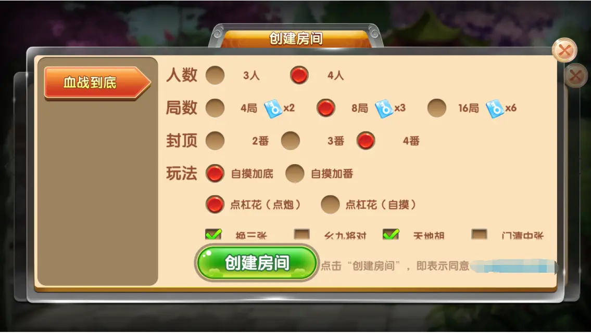
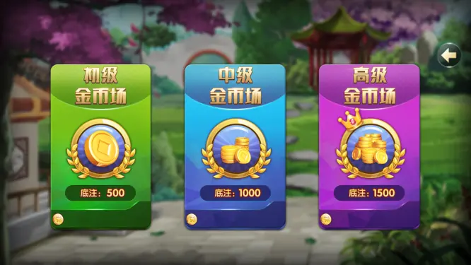
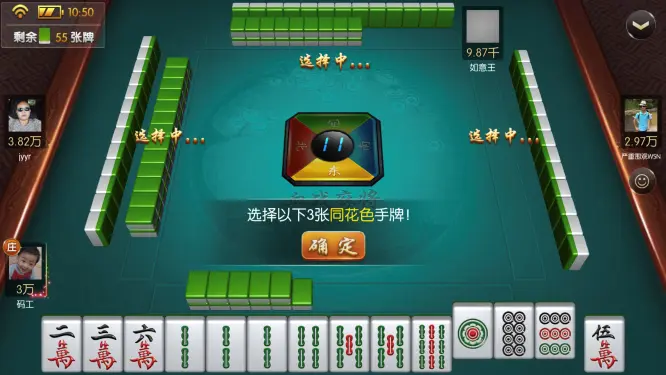
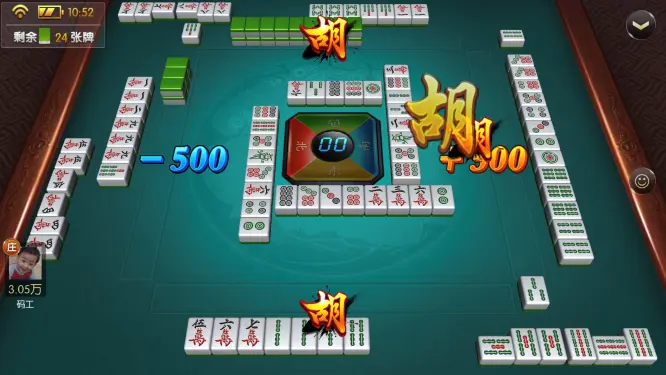
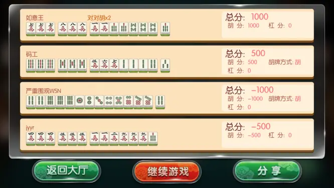

# 棋牌房卡游戏

## 介绍
Unity3D棋牌游戏集成多种电玩,麻将,扑克游戏;
### 支持多种大厅皮肤切换
内置多种大厅皮肤, 支持自定义大厅皮肤, 各种换皮,瞬间切换;
### 支持多种游戏模式
  - 开房模式
  - 茶馆模式
  - 俱乐部模式
  - 金币模式
  - 快速游戏模式
  - 防作弊模式
  - 比赛模式

各种模式随意搭配. 快速构建自己的游戏平台.
### 支持多种游戏类型
#### 电玩类: 
  - 老虎机
  - 捕鱼(金蟾捕鱼,哪吒闹海,鱼王争霸)
  - 水果机
  - 森林舞会
  - 六狮王朝
  - 奔驰宝马
  - 金鲨银鲨
  - ......
#### 麻将类: 
  - 红中麻将
  - 转转麻将
  - 卡五星
  - 血战麻将
  - 广东麻将
  - 大连麻将
  - 长沙麻将
  - 四川麻将
  - 沈阳麻将
  - 盘锦麻将
  - ......
#### 扑克类: 
  - 斗地主
  - 跑得快
  - 德州扑克
  - 炸金花
  - 牛牛
  - 百人牛牛 
  - 百团大战
  - 龙虎斗
  - 百家乐
  - 21点
  - 梭哈
  - ......

各种游戏可以自由搭配, 满足不同玩家需求.

## AI陪玩
  - 80%游戏支持AI陪玩
  - 所有麻将游戏支持AI陪玩
  - 斗地主支持AI陪玩
  - 所有百人游戏支持AI陪玩

### 软件架构
#### 开发工具：Unity3D
#### 开发语言：服务器: Java +PHP, 客户端: C#
#### 数据库：MySQL
 
### 使用说明
1. 直接运行可执行游戏 

2. 进入游戏大厅

3. 进入游戏房间

4. 开始游戏

5. 结算

